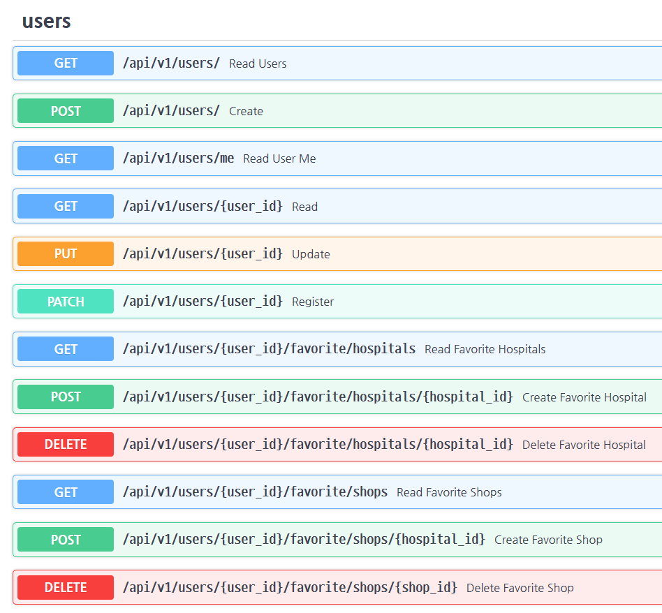
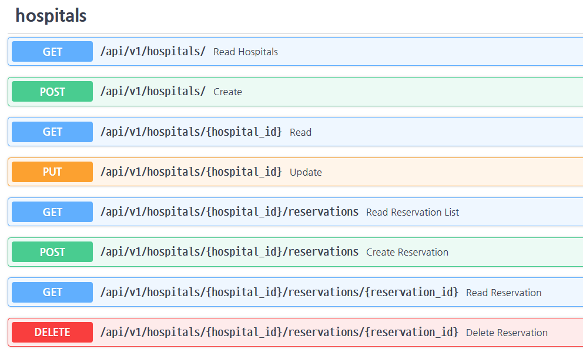
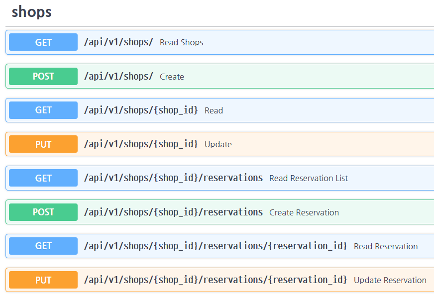
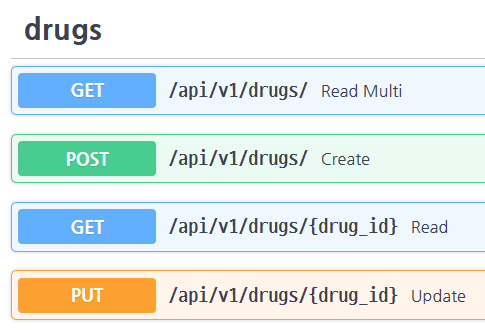
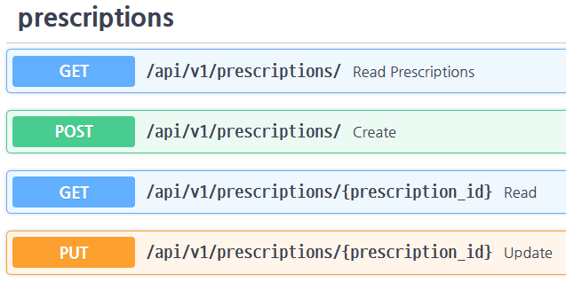
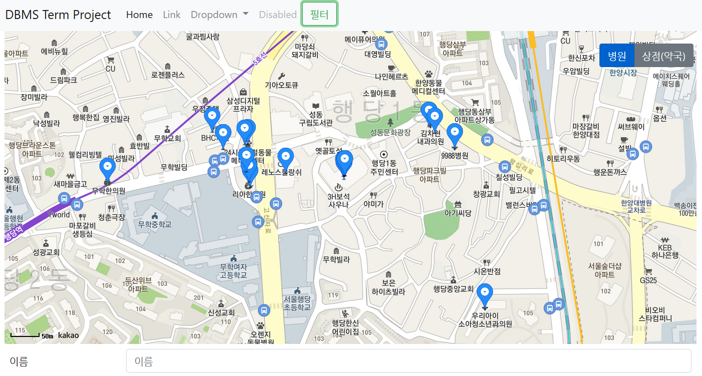

# DBMS Term Project

자신의 주변에 있는 병원/약국 정보를 띄워주고 이를 예약(실제로 이루어지는 것이 아닌 시뮬레이션)하고 처방전을 발급할 수 있는 웹 어플리케이션입니다. (In progress)

## License

This repository is licenced under the MIT License.

## 실행 방법

```bash
docker-compose -f docker-compose.yml up -d
```

초기 사용자 및 약 데이터를 제공하기 위해서는 `docker-compose up -d` 명령어로 실행해야 하며, `./src/` 경로에 `customers.csv` 파일과 `drugs.csv` 파일이 있어야 합니다.

docker-compose를 통해 어플리케이션이 정상적으로 실행된 경우 `http://localhost`에 접속하여 프론트엔드에 접속할 수 있습니다.

`http://localhost/docs` 주소로 백엔드의 OpenAPI 내역을 확인할 수 있습니다.

## 완성 내역

- 회원 관리 ==> 구현 완료 (`GET /api/v1/users/`, `POST /api/v1/users/`, `GET /api/v1/users/{user_id}`, `PUT /api/v1/users/{user_id}`)
- 사용자 별 로그인 기능 ==> 구현 완료 (`GET /api/v1/login`)
- API로부터 DB 구축 ==> 구현 완료 (`./src/init_db.py`)
- 병원 - 병원 등록 ==> 구현 완료 (`POST /api/v1/hospitals/`)
- 병원 - 예약 환자 관리 ==> 구현 완료 (`GET /api/v1/hospitals/{hospital_id}/reservations`)
- 병원 - 기존 환자 관리 ==> 구현 완료 (`GET /api/v1/hospitals/{hospital_id}/reservations`)
- 병원 - 처방 관리 ==> 구현 완료 (`GET /api/v1/prescriptions/?hospital_id={hospital_id}`)
- 환자 - 병원 검색 ==> 구현 완료 (`GET /api/v1/hospitals/`)
- 환자 - 병원 예약 ==> 구현 완료 (`POST /api/v1/hospitals/{hospital_id}/reservations`)
- 환자 - 상점 검색 ==> 구현 완료 (`GET /api/v1/shops/`)
- 환자 - 상점 예약 ==> 구현 완료 (`POST /api/v1/shops/{shop_id}/reservations`)
- 상점 - 처방전 ==> 구현 완료 (`GET /api/v1/prescriptions/{prescription_id}`)

## 목차

- [DBMS Term Project](#dbms-term-project)
  - [License](#license)
  - [실행 방법](#%ec%8b%a4%ed%96%89-%eb%b0%a9%eb%b2%95)
  - [완성 내역](#%ec%99%84%ec%84%b1-%eb%82%b4%ec%97%ad)
  - [목차](#%eb%aa%a9%ec%b0%a8)
  - [진행 설명](#%ec%a7%84%ed%96%89-%ec%84%a4%eb%aa%85)
    - [Ⅰ. 프레임워크 선정](#%e2%85%a0-%ed%94%84%eb%a0%88%ec%9e%84%ec%9b%8c%ed%81%ac-%ec%84%a0%ec%a0%95)
      - [1. DBMS](#1-dbms)
      - [2. 백엔드](#2-%eb%b0%b1%ec%97%94%eb%93%9c)
      - [3. 프론트엔드](#3-%ed%94%84%eb%a1%a0%ed%8a%b8%ec%97%94%eb%93%9c)
      - [4. 데이터 수집 API](#4-%eb%8d%b0%ec%9d%b4%ed%84%b0-%ec%88%98%ec%a7%91-api)
    - [Ⅱ. DB 테이블 모델링](#%e2%85%a1-db-%ed%85%8c%ec%9d%b4%eb%b8%94-%eb%aa%a8%eb%8d%b8%eb%a7%81)
      - [1. 병원](#1-%eb%b3%91%ec%9b%90)
      - [2. 상점(약국 포함)](#2-%ec%83%81%ec%a0%90%ec%95%bd%ea%b5%ad-%ed%8f%ac%ed%95%a8)
      - [3. 사용자](#3-%ec%82%ac%ec%9a%a9%ec%9e%90)
      - [4. 약](#4-%ec%95%bd)
      - [5. 처방전](#5-%ec%b2%98%eb%b0%a9%ec%a0%84)
      - [6. 병원/상점 방문 예약](#6-%eb%b3%91%ec%9b%90%ec%83%81%ec%a0%90-%eb%b0%a9%eb%ac%b8-%ec%98%88%ec%95%bd)
      - [7. 즐겨찾기](#7-%ec%a6%90%ea%b2%a8%ec%b0%be%ea%b8%b0)
    - [Ⅲ. 초기 DB 구축](#%e2%85%a2-%ec%b4%88%ea%b8%b0-db-%ea%b5%ac%ec%b6%95)
    - [Ⅳ. API 엔드포인트 지정](#%e2%85%a3-api-%ec%97%94%eb%93%9c%ed%8f%ac%ec%9d%b8%ed%8a%b8-%ec%a7%80%ec%a0%95)
      - [1. 유저 관련 URI](#1-%ec%9c%a0%ec%a0%80-%ea%b4%80%eb%a0%a8-uri)
      - [2. 병원 관련 URI](#2-%eb%b3%91%ec%9b%90-%ea%b4%80%eb%a0%a8-uri)
      - [3. 상점 관련 URI](#3-%ec%83%81%ec%a0%90-%ea%b4%80%eb%a0%a8-uri)
      - [4. 약 관련 URI](#4-%ec%95%bd-%ea%b4%80%eb%a0%a8-uri)
      - [5. 처방전 관련 URI](#5-%ec%b2%98%eb%b0%a9%ec%a0%84-%ea%b4%80%eb%a0%a8-uri)
    - [Ⅴ. 백엔드와 프론트엔드 연결](#%e2%85%a4-%eb%b0%b1%ec%97%94%eb%93%9c%ec%99%80-%ed%94%84%eb%a1%a0%ed%8a%b8%ec%97%94%eb%93%9c-%ec%97%b0%ea%b2%b0)
    - [Ⅵ. 프론트엔드 접속](#%e2%85%a5-%ed%94%84%eb%a1%a0%ed%8a%b8%ec%97%94%eb%93%9c-%ec%a0%91%ec%86%8d)

## 진행 설명

### Ⅰ. 프레임워크 선정

#### 1. DBMS

DBMS로는 저번 과제와 마찬가지로 [PostgreSQL](https://www.postgresql.org/)을 사용하였습니다. 이미 사용한 환경이어서 익숙한 것도 있었지만, PostgreSQL의 확장 중 하나인 [PostGIS](https://postgis.net/)를 이용할 경우, 병원/약국/사용자의 위도와 경도를 Geometry값으로 변환하여 저장할 뿐만 아니라 이를 자체적인 알고리즘을 통해 인덱싱하여 특정 좌표를 기준으로 한 검색 등에서 빠른 결과를 낸다는 점에 착안하였습니다.

#### 2. 백엔드

백엔드로는 저번과 마찬가지로 [FastAPI](https://fastapi.tiangolo.com/)를 이용하였습니다. REST API 기반의 백엔드를 쉽게 작성할 뿐만 아니라, 자체적인 data validation을 거쳐준다는 것이 장점입니다.

DBMS 통신 모듈로는 [SQLAlchemy](https://www.sqlalchemy.org/) 및 [GeoAlchemy 2](https://geoalchemy-2.readthedocs.io/)를 채용했습니다. GeoAlchemy 2는 SQLAlchemy가 PostGIS의 문법을 정상적으로 이해하고 처리할 수 있도록 도와주는 애드온입니다.

#### 3. 프론트엔드

프론트엔드는 FastAPI 내에서 `./src/templates/`과 `./static/` 폴더에 있는 파일들을 호스팅하도록 하였고, 브라우저에서 백엔드와 통신할 수 있도록 관련 함수들을 Javascript(ECMAScript 5.1) 및 [jQuery](https://jquery.com/)로 선언하였습니다.

추가적으로, 백엔드에서 받은 좌표 정보를 지도로 띄울 수 있도록 [Kakao 지도 API](http://apis.map.kakao.com/)에서 지도 이미지를 받아와 그 위에 마커를 띄우기로 하였습니다.

#### 4. 데이터 수집 API

병원 및 약국 정보는 공공데이터포털에서 얻을 수 있는 데이터셋 중 국립중앙의료원에서 제공하는 '전국 병‧의원 찾기 서비스' 및 '전국 약국 정보 조회 서비스'를 이용하였습니다. 과제에서 제시한 건강보험심사평가원의 API의 경우, 의원의 영업 시간이 포함되지 않은 정보를 제공할 뿐더러, URI에 검색 기준 위치를 포함해야만 작동하므로, 제가 구성하고자 한 DB에는 어울리지 않다고 판단하여 이를 교체하였습니다.

### Ⅱ. DB 테이블 모델링

#### 1. 병원

```python
# ./src/app/models/hospital.py

class Hospital(Base):
    __tablename__ = "hospitals"
    id: int = Column(Integer, primary_key=True, autoincrement=True)
    name: str = Column(String, nullable=False)
    addr: str = Column(String, nullable=False)
    tel: str = Column(String, nullable=False)
    lon: float = Column(Float, nullable=False)
    lat: float = Column(Float, nullable=False)
    geom: str = Column(Geometry("POINT", srid=4326), nullable=False)
    strCnd: int = Column(Integer, nullable=False)
    dutyTime1s: time = Column(Time)
    dutyTime1c: time = Column(Time)
    dutyTime2s: time = Column(Time)
    dutyTime2c: time = Column(Time)
    dutyTime3s: time = Column(Time)
    dutyTime3c: time = Column(Time)
    dutyTime4s: time = Column(Time)
    dutyTime4c: time = Column(Time)
    dutyTime5s: time = Column(Time)
    dutyTime5c: time = Column(Time)
    dutyTime6s: time = Column(Time)
    dutyTime6c: time = Column(Time)
    dutyTime7s: time = Column(Time)
    dutyTime7c: time = Column(Time)
    dutyTime8s: time = Column(Time)
    dutyTime8c: time = Column(Time)
    course_bitmask: int = Column(Integer, nullable=False)
    doctors = relationship("User")
    reservations = relationship("HospReservation")
```

가장 먼저 구축한 것은 병원 테이블이었습니다. 자체적으로 포함해야 할 자료로는 병원 이름, 주소, 전화번호, 위치(WGS 84 좌표계 및 PostGIS Geometry 자료형), 전문의 수, 영업시간(1: 월요일 ~ 7: 일요일, 8: 공휴일)이 있으므로, 이를 선언해 주었습니다.

포함된 column 중 `course_bitmask`의 경우, 해당 병원에서 진료할 수 있는 과목들을 bitwise로 저장합니다. 각 이진수 자랏수가 담당하는 진료 과목은 다음과 같습니다:

> 1. 일반의 (2 \*\* 1)
> 2. 내과 (2 \*\* 2)
> 3. 신경과 (2 \*\* 3)
> 4. 정신건강의학과 (2 \*\* 4)
> 5. 외과 (2 \*\* 5)
> 6. 정형외과 (2 \*\* 6)
> 7. 신경외과 (2 \*\* 7)
> 8. 흉부외과 (2 \*\* 8)
> 9. 성형외과 (2 \*\* 9)
> 10. 마취통증의학과 (2 \*\* 10)
> 11. 산부인과 (2 \*\* 11)
> 12. 소아청소년과 (2 \*\* 12)
> 13. 안과 (2 \*\* 13)
> 14. 이비인후과 (2 \*\* 14)
> 15. 피부과 (2 \*\* 15)
> 16. 비뇨의학과 (2 \*\* 16)
> 17. 영상의학과 (2 \*\* 17)
> 18. 방사선종양학과 (2 \*\* 18)
> 19. 병리과 (2 \*\* 19)
> 20. 진단검사의학과 (2 \*\* 20)
> 21. 결핵과 (2 \*\* 21)
> 22. 재활의학과 (2 \*\* 22)
> 23. 핵의학과 (2 \*\* 23)
> 24. 가정의학과 (2 \*\* 24)
> 25. 응급의학과 (2 \*\* 25)
> 26. 직업환경의학과 (2 \*\* 26)
> 27. 예방의학과 (2 \*\* 27)
> 28. 치과 (2 \*\* 28)

#### 2. 상점(약국 포함)

```Python
# ./src/app/models/shop.py

class Shop(Base):
    __tablename__ = "shops"
    id = Column(Integer, primary_key=True, autoincrement=True)
    name = Column(String, nullable=False)
    addr = Column(String, nullable=False)
    lon = Column(Float, nullable=False)
    lat = Column(Float, nullable=False)
    tel = Column(String, nullable=False)
    geom = Column(Geometry("POINT", srid=4326), nullable=False)
    is_pharmacy = Column(Boolean, nullable=False, index=True)
    dutyTime1s = Column(Time)
    dutyTime1c = Column(Time)
    dutyTime2s = Column(Time)
    dutyTime2c = Column(Time)
    dutyTime3s = Column(Time)
    dutyTime3c = Column(Time)
    dutyTime4s = Column(Time)
    dutyTime4c = Column(Time)
    dutyTime5s = Column(Time)
    dutyTime5c = Column(Time)
    dutyTime6s = Column(Time)
    dutyTime6c = Column(Time)
    dutyTime7s = Column(Time)
    dutyTime7c = Column(Time)
    dutyTime8s = Column(Time)
    dutyTime8c = Column(Time)
    admins = relationship("User")
    reservations = relationship("ShopReservation")
```

상점은 병원 테이블과 거의 유사하지만, 전문의의 수를 체크할 필요가 없으므로 해당 column은 제외하였습니다. 하지만 상점 중 약국인 경우를 판별할 수 있어야 하므로, `is_pharmacy`라는 `BOOLEAN` 자료형 column을 추가하여 이를 저장하도록 하였습니다.

#### 3. 사용자

```python
# ./src/app/models/user.py

class User(Base):
    __tablename__ = "users"
    id = Column(Integer, primary_key=True, autoincrement=True)
    name = Column(String, nullable=False, index=True)
    email = Column(String, nullable=False, unique=True, index=True)
    tel = Column(String, nullable=False, index=True)
    lon = Column(Float, nullable=False)
    lat = Column(Float, nullable=False)
    geom = Column(Geometry("Point"), nullable=False)
    password = Column(String, nullable=False)
    is_active = Column(Boolean, default=False)
    hosp_id = Column(Integer, ForeignKey("hospitals.id", ondelete="SET NULL"))
    shop_id = Column(Integer, ForeignKey("shops.id", ondelete="SET NULL"))
    hospital_reservations = relationship("HospReservation")
    shop_reservations = relationship("ShopReservation")
```

> **주의!**
>
> 본 어플리케이션에서 사용자의 비밀번호는 평문으로 저장됩니다. 이 코드를 실제 어플리케이션에 사용하지 마세요!

환자/병원/상점 사용자를 여러 테이블에서 관리하면 로그인 등 사이트 이용객 입장에서 거쳐야 할 절차가 오히려 복잡해지므로, 한 테이블에 정보를 저장한 후, `hosp_id`나 `shop_id`에 자신의 병원/상점 ID를 등록할 경우 해당 병원/상점의 관리자로 등록되며, 이를 통해 자신의 병원/상점 자료에 접근할 수 있도록 설정하였습니다.

로그인 처리를 위해 이메일은 고유한 문자열이어야 하므로, `UNIQUE` 옵션을 사용하여 중복된 값이 들어오지 않도록 하였습니다.

`is_active`를 추가하였고, 기본값 `False`에서 첫 로그인 시에 본인의 계정 상태(병원 운영 여부/ 상점 운영 여부)를 정하면 True가 되게 하였습니다.

#### 4. 약

```python
# ./src/app/models/drug.py

class Drug(Base):
    __tablename__ = "drugs"
    id = Column(Integer, primary_key=True, autoincrement=True)
    name = Column(String, nullable=False, unique=True, index=True)
    unit = Column(String)
```

약의 이름과 그 약을 세릴 때의 단위를 저장해두는 테이블을 지정하여, 후에 처방전을 발급할 때 이 약의 id만으로 약을 구분할 수 있도록 하였습니다.

#### 5. 처방전

```python
# ./src/app/models/prescription.py

class PrescribedDrug(Base):
    __tablename__ = "prescribed_drugs"
    id = Column(Integer, primary_key=True, autoincrement=True)
    drug_id = Column(Integer, ForeignKey("drugs.id", ondelete="SET NULL"))
    drug = relationship("Drug", uselist=False)
    drug_amount_per_dose = Column(Integer, nullable=False)
    drug_doses_per_day = Column(Integer, nullable=False)
    drug_total_days = Column(Integer, nullable=False)
    prescription_id = Column(
        Integer, ForeignKey("prescriptions.id", ondelete="SET NULL")
    )


class Prescription(Base):
    __tablename__ = "prescriptions"
    id: int = Column(Integer, primary_key=True, autoincrement=True)
    hospital_reservation_id: int = Column(
        Integer, ForeignKey("hospital_reservations.id", ondelete="SET NULL")
    )
    hospital_reservation = relationship("HospReservation", uselist=False)
    prescribed_date: datetime = Column(DateTime)
    prescribed_drugs = relationship("PrescribedDrug")
    filled_shop_id: int = Column(Integer, ForeignKey("shops.id", ondelete="SET NULL"))
    filled_date: datetime = Column(DateTime)
    filled_detail: str = Column(String)
```

상기 테이블에서 생성한 약의 데이터를 이용하여 처방전을 발급할 수 있도록 하였습니다. 처방전은 최초 발급 시 병원에서 발급하므로, 병원 진료 결과 ID인 `hospital_reservation_id`, 발급 날짜인 `prescribed_date`를 저장하여야 하며, 여기에 `prescribed_drugs`로 처방하고자 하는 약을 저장시키도록 하였습니다.

`prescribed_drugs` 테이블의 경우, 앞서 선언한 약의 ID, 1회 복용양, 1일 복용 횟수, 총 복용일수 네 가지를 묶어 저장시키고, 이를 `prescription_id`를 통해 발급한 처방전에 연결시켰습니다.

이후 약국에서 해당 처방전에 대해 약을 처방할 경우, 처방한 약국`filled_shop_id`과 처방한 날짜`filled_date`, 처방 내역`filled_detail`을 새로 update하도록 하였습니다.

#### 6. 병원/상점 방문 예약

```python
# ./src/app/models/reservation.py

class HospReservation(Base):
    __tablename__ = "hospital_reservations"
    id = Column(Integer, primary_key=True, autoincrement=True)
    user_id = Column(Integer, ForeignKey("users.id", ondelete="SET NULL"))
    hosp_id = Column(Integer, ForeignKey("hospitals.id", ondelete="SET NULL"))
    date = Column(DateTime, nullable=False)


class ShopReservation(Base):
    __tablename__ = "shop_reservations"
    id = Column(Integer, primary_key=True, autoincrement=True)
    user_id = Column(Integer, ForeignKey("users.id", ondelete="SET NULL"))
    shop_id = Column(Integer, ForeignKey("shops.id", ondelete="SET NULL"))
    date = Column(DateTime, nullable=False)
    prescription_id = Column(
        Integer, ForeignKey("prescriptions.id", ondelete="SET NULL")
    )
    prescription = relationship("Prescription", uselist=False)
    is_able_to_prescribe = Column(Boolean)
```

병원 예약에는 예약 유저의 ID, 병원의 ID, 희망하는 진료 날짜를 저장할 수 있도록 하였습니다.

상점 예약에는 예약 유저의 ID, 상점의 ID, 희망하는 방문 날짜, 그리고 처방받고 싶은 처방전의 ID를 저장할 수 있게 하였습니다.

`is_able_to_prescribe` column은 해당 약국이 이 약을 처방할 수 있는지의 여부를 저장하는 `Boolean` 자료형이며, Null일 시 처방을 하지 않은 상황, True일 시 처방이 가능한 상황, False일 시 처방이 불가능한 상황임을 나타내도록 하였습니다.

#### 7. 즐겨찾기

```python
# ./src/app/models/favorite.py

class FavoriteHospital(Base):
    __tablename__ = "favorite_hospitals"
    user_id = Column(Integer, ForeignKey("users.id", ondelete="CASCADE"), primary_key=True)
    hospital_id = Column(Integer, ForeignKey("hospitals.id", ondelete="CASCADE"), primary_key=True)


class FavoriteShop(Base):
    __tablename__ = "favorites_shops"
    user_id = Column(Integer, ForeignKey("users.id", ondelete="CASCADE"), primary_key=True)
    shop_id = Column(Integer, ForeignKey("shops.id", ondelete="CASCADE"), primary_key=True)
```

즐겨찾기의 경우, 한 사람은 한 병원/상점의 즐겨찾기 등록을 단 1회만 가능해야 하므로, 다른 table들과 달리 별다른 자동 생성 ID 없이 `user_id`와 `hospital_id`/`shop_id` 두 값의 조합이 Primary Key로서 작용하도록 디자인했습니다.

### Ⅲ. 초기 DB 구축

```python
# ./src/init_db.py

def request_url(url: str, serviceKey: str, page: int) -> Optional[dict]:
    queryParams = {
        "ServiceKey": serviceKey,
        "pageNo": page,
        "numOfRows": 100,
        "_type": "json",
    }
    r = requests.get(url, params=queryParams)
    json: dict = {}
    try:
        json = r.json()
    except JSONDecodeError:
        print("Error: response content is not JSON")
        print(r.text)
    finally:
        return json


def add_hospital(item: dict):
    # 좌표정보가 없을 시 DB에 추가하지 않고 넘어감
    if not ("wgs84Lon" in item) or not ("wgs84Lat" in item):
        print("Warning: current data has no longitude/latitude")
        return

    # 전화번호 양식이 잘못되었을 경우 추가하지 않고 넘어감
    tel = (
        str(item["dutyTel1"]).replace("(", "").replace(")", "").replace("-", "").strip()
    )
    if re.fullmatch("^(0\d{1,2})?-?\d{3,4}-?\d{4}$", tel) is None:
        print(
            "Warning: current data has incorrect form of tel: " + str(item["dutyTel1"])
        )
        return

    hospital = HospitalCreate(
        name=item["dutyName"],
        addr=item["dutyAddr"],
        tel=tel,
        lon=float(item["wgs84Lon"]),
        lat=float(item["wgs84Lat"]),
        strCnd=random.randint(1, 10),
        course_bitmask=random.randint(1, 2 ** 29 - 1),
    )

    # 중략

    db = Session()
    try:
        create_hospital(db=db, hospital_in=hospital)
    except:
        db.rollback()
        raise
    finally:
        db.close()


def add_shop(item: dict):
    # 좌표정보가 없을 시 DB에 추가하지 않고 넘어감
    if not ("wgs84Lon" in item) or not ("wgs84Lat" in item):
        print("Warning: current data has no longitude/latitude")
        return

    # 전화번호 양식이 잘못되었을 경우 추가하지 않고 넘어감
    tel = (
        str(item["dutyTel1"]).replace("(", "").replace(")", "").replace("-", "").strip()
    )
    if re.fullmatch("^(0\d{1,2})?-?\d{3,4}-?\d{4}$", tel) is None:
        print(
            "Warning: current data has incorrect form of tel: " + str(item["dutyTel1"])
        )
        return

    shop = ShopCreate(
        name=item["dutyName"],
        addr=item["dutyAddr"],
        tel=tel,
        lon=float(item["wgs84Lon"]),
        lat=float(item["wgs84Lat"]),
    )

    # 중략

    db = Session()
    try:
        create_shop(db=db, shop_in=shop)
    except:
        db.rollback()
        raise
    finally:
        db.close()


def add_user(item: dict):
    user = UserCreate(
        name=item["name"],
        tel=item["phone"],
        email=item["local"] + "@" + item["domain"],
        password=item["passwd"],
        lon=item["lng"],
        lat=item["lat"],
    )
    db = Session()
    try:
        if read_by_email(db, email=user.email) is not None:
            print(
                f"Warning: the email of this user is already registered: {user.email}"
            )
            return
        create_user(db, user=user)
    except:
        db.rollback()
        raise
    finally:
        db.close()


def add_drug(item: dict):
    drug = DrugCreate(name=item["name"], unit=item["unit"])
    db = Session()
    try:
        if read_by_name(db, name=drug.name) is not None:
            print(f"Warning: the name of this drug is already registered: {drug.name}")
            return
        create_drug(db, drug=drug)
    except:
        db.rollback()
        raise
    finally:
        db.close()


def init_db():
    serviceKey: str = os.environ["SERVICE_KEY"]
    Base.metadata.create_all(bind=engine)

    # Adding hospitals from API
    print("============================")
    print("Adding initial hospital data")
    print("============================")
    url = (
        "http://apis.data.go.kr/B552657/HsptlAsembySearchService/getHsptlMdcncFullDown"
    )
    totPage = 700
    curPage = 1
    while curPage <= totPage:
        js = request_url(url, serviceKey, curPage)
        if js is not {}:
            if curPage is 1:
                totPage = int(js["response"]["body"]["totalCount"] / 100)
                print(
                    "Total hospitals in API: ",
                    int(js["response"]["body"]["totalCount"]),
                )
            for item in js["response"]["body"]["items"]["item"]:
                add_hospital(item)
        if curPage % 20 is 0:
            print(f"{curPage} pages processed ({curPage} / {totPage})")
        curPage += 1
    print("Hospitals added")
    print("")

    # Adding stores from API
    print("============================")
    print("Adding initial shop data")
    print("============================")
    url = (
        " http://apis.data.go.kr/B552657/ErmctInsttInfoInqireService/getParmacyFullDown"
    )
    totPage = 200
    curPage = 1
    while curPage <= totPage:
        js = request_url(url, serviceKey, curPage)
        if js is not {}:
            if curPage is 1:
                totPage = int(js["response"]["body"]["totalCount"] / 100)
                print(
                    "Total shops in API: ", int(js["response"]["body"]["totalCount"]),
                )
            for item in js["response"]["body"]["items"]["item"]:
                add_shop(item)
            totPage = int(js["response"]["body"]["totalCount"] / 100)
        if curPage % 20 is 0:
            print(f"{curPage} pages processed ({curPage} / {totPage})")
        curPage += 1
        curPage += 1
    print("Shops added")
    print("")

    # Adding users from customers.csv (Dev only)
    if os.environ["APP_MODE"] == "DEV":
        print("============================")
        print("Adding initial user data")
        print("============================")
        with open("customers.csv", mode="r", newline="", encoding="UTF-8") as r:
            reader = csv.DictReader(r)
            idx: int = 1
            for item in reader:
                add_user(item)
                if idx % 500 is 0:
                    print(f"{idx} lines processed")
                idx += 1
        print("Users added")
        print("")

    # Adding drugs from drugs.csv (Dev only)
    if os.environ["APP_MODE"] == "DEV":
        print("============================")
        print("Adding initial drug data")
        print("============================")
        with open("drugs.csv", mode="r", newline="", encoding="UTF-8") as r:
            reader = csv.DictReader(r)
            idx: int = 1
            for item in reader:
                add_drug(item)
                if idx % 500 is 0:
                    print(f"{idx} lines processed")
                idx += 1
        print("Drugs added")
        print("")


if __name__ == "__main__":
    print("Initialize DB")
    Base.metadata.create_all(bind=engine)
    init_db()
    print("Initializing finished")
```

DB 구축 작업의 경우, docker image가 실행될 때 자동으로 실행되도록 디자인하였습니다. 이 때, API에서 요구하는 `ServiceKey`의 경우, docker-compose에 환경 변수로 지정하여 각자의 키를 이용할 수 있도록 하였습니다.

개발 환경에서는 과제에서 주어진 유저데이터의 csv 파일과, 개인적으로 직접 생성한 약의 csv 파일을 추가적으로 불러들여 처방전 발급 테스트 등이 용이하도록 하였습니다.

### Ⅳ. API 엔드포인트 지정

#### 1. 유저 관련 URI

```python
# ./src/app/api/v1/endpoints/users.py
# routing URI: (domain)/api/v1/users

@router.get("/", response_model=List[User])
def read_users(
    db: Session = Depends(get_db), skip: int = 0, limit: conint(le=100) = 100,
):
    users = user.read_multi(db, skip=skip, limit=limit)
    return users


@router.post("/", response_model=User)
def create(db: Session = Depends(get_db), *, user_in: UserCreate):
    usr = user.create(db, user=user_in)
    return usr


@router.get("/{user_id}", response_model=User)
def read(
    db: Session = Depends(get_db),
    user_id: int = Path(..., title="The ID of the user to read", ge=1),
):
    usr = user.read(db, user_id=user_id)
    if not usr:
        raise HTTPException(
            status_code=404, detail="User not found",
        )
    return usr


@router.patch("/{user_id}", response_model=User)
def register(
    db: Session = Depends(get_db),
    *,
    user_id: int = Path(..., title="The ID of the user to register", ge=1),
    user_in: UserRegister,
):
    usr = user.read(db, user_id=user_id)
    if not usr:
        raise HTTPException(
            status_code=404, detail="User not found",
        )
    usr = user.register(db, user=usr, user_in=user_in)
    return usr


@router.put("/{user_id}", response_model=User)
def update(
    db: Session = Depends(get_db),
    *,
    user_id: int = Path(..., title="The ID of the user to update", ge=1),
    user_in: UserUpdate,
):
    usr = user.read(db, user_id=user_id)
    if not usr:
        raise HTTPException(
            status_code=404, detail="User not found",
        )
    usr = user.update(db, user=usr, user_in=user_in)
    return usr


@router.get("/{user_id}/favorite/hospitals", response_model=List[FavoriteHospital])
def read_favorite_hospitals(
    db: Session = Depends(get_db),
    *,
    user_id: int = Path(
        ..., title="The ID of the user to read favorite hospitals", ge=1
    ),
):
    usr = user.read(db, user_id=user_id)
    if not usr:
        raise HTTPException(
            status_code=404, detail="User not found",
        )
    return favorite.read_hospital_multi(db, user_id=user_id)


@router.post(
    "/{user_id}/favorite/hospitals/{hospital_id}", response_model=FavoriteHospital
)
def create_favorite_hospital(
    db: Session = Depends(get_db),
    *,
    user_id: int = Path(
        ...,
        title="The ID of the user to add the hospital to the favorite hospital list",
        ge=1,
    ),
    hospital_id: int = Path(
        ...,
        title="The ID of the hospital to be added to the user's favorite hospital list",
        ge=1,
    ),
):
    usr = user.read(db, user_id=user_id)
    if not usr:
        raise HTTPException(
            status_code=404, detail="User not found",
        )
    hosp = hospital.read(db, hospital_id=hospital_id)
    if not hosp:
        raise HTTPException(
            status_code=404, detail="Hospital not found",
        )
    return favorite.create_hospital(db, user_id=user_id, hospital_id=hospital_id)


@router.delete(
    "/{user_id}/favorite/hospitals/{hospital_id}",
    response_model=Optional[FavoriteHospital],
)
def delete_favorite_hospital(
    db: Session = Depends(get_db),
    *,
    user_id: int = Path(
        ...,
        title="The ID of the user to remove the hospital from the favorite hospital list",
        ge=1,
    ),
    hospital_id: int = Path(
        ...,
        title="The ID of the hospital to be removeded from the user's favorite hospital list",
        ge=1,
    ),
):
    usr = user.read(db, user_id=user_id)
    if not usr:
        raise HTTPException(
            status_code=404, detail="User not found",
        )
    hosp = hospital.read(db, hospital_id=hospital_id)
    if not hosp:
        raise HTTPException(
            status_code=404, detail="Hospital not found",
        )
    fav = favorite.read_hospital(db, user_id=user_id, hospital_id=hospital_id)
    if not fav:
        raise HTTPException(
            status_code=400,
            detail="The hospital is not in the favorite list of this user",
        )
    return favorite.delete_hospital(db, fav=fav)


@router.get("/{user_id}/favorite/shops", response_model=List[FavoriteShop])
def read_favorite_shops(
    db: Session = Depends(get_db),
    *,
    user_id: int = Path(..., title="The ID of the user to read favorite shops", ge=1),
):
    usr = user.read(db, user_id=user_id)
    if not usr:
        raise HTTPException(
            status_code=404, detail="User not found",
        )
    return favorite.read_shop_multi(db, user_id=user_id)


@router.post("/{user_id}/favorite/shops/{hospital_id}", response_model=FavoriteShop)
def create_favorite_shop(
    db: Session = Depends(get_db),
    *,
    user_id: int = Path(..., title="The ID of the user to read favorite shop", ge=1),
    shop_id: int = Path(
        ..., title="The ID of the shop to add as a favorite shop", ge=1
    ),
):
    usr = user.read(db, user_id=user_id)
    if not usr:
        raise HTTPException(
            status_code=404, detail="User not found",
        )
    shp = shop.read(db, shop_id=shop_id)
    if not shp:
        raise HTTPException(
            status_code=404, detail="Shop not found",
        )
    return favorite.create_shop(db, user_id=user_id, shop_id=shop_id)

@router.delete(
    "/{user_id}/favorite/shops/{shop_id}",
    response_model=Optional[FavoriteShop],
)
def delete_favorite_shop(
    db: Session = Depends(get_db),
    *,
    user_id: int = Path(
        ...,
        title="The ID of the user to remove the shop from one's favorite list",
        ge=1,
    ),
    shop_id: int = Path(
        ...,
        title="The ID of the shop to be removeded from the user's favorite list",
        ge=1,
    ),
):
    usr = user.read(db, user_id=user_id)
    if not usr:
        raise HTTPException(
            status_code=404, detail="User not found",
        )
    shp = shop.read(db, shop_id=shop_id)
    if not shp:
        raise HTTPException(
            status_code=404, detail="Shop not found",
        )
    fav = favorite.read_shop(db, user_id=user_id, shop_id=shop_id)
    if not fav:
        raise HTTPException(
            status_code=400,
            detail="The shop is not in the user's favorite list",
        )
    return favorite.delete_shop(db, fav=fav)
```



`/users` URI에는 사용자와 관련된 전반적인 처리를 하도록 하였습니다.

`user_id` 없이 `GET` Request를 넣을 경우 유저 목록 불러오기, `POST` Request를 넣을 경우 유저 생성이 되도록 하였습니다.

`/users/{user_id}` URI에는 해당 ID값을 지닌 유저에 대한 작업을 할 수 있도록 하였습니다. `GET`의 경우 해당 유저의 정보를 불러오며, `PUT`의 경우 해당 유저의 정보 일부를 수정할 수 있으며, `PATCH`의 경우, 과제에서 지정한 대로 사용자가 특정 병원/상점의 ID를 입력할 경우 해당 병원/상점의 관리자로 승격될 수 있는 처리입니다.

`/users/{user_id}/favorite/hospitals`의 경우 병원 즐겨찾기 관련 URI이며, 마찬가지로 `/users/{user_id}/favorite/shops`는 상점 즐겨찾기 관련 URI입니다.

#### 2. 병원 관련 URI

```python
# ./src/app/api/v1/endpoints/hospitals.py
# routing URI: (domain)/api/v1/hospitals

@router.get("/", response_model=List[Hospital])
def read_hospitals(
    db: Session = Depends(get_db),
    q: Optional[str] = None,
    skip: int = 0,
    limit: conint(le=100) = 100,
    lat: confloat(ge=-90.0, le=90.0) = 37.5585146,
    lon: confloat(ge=-180.0, le=180.0) = 127.0431892,
    radius: conint(le=5000) = 5000,
):
    hospitals = hospital.read_by_distance(
        db, q=q, lat=lat, lon=lon, radius=radius, skip=skip, limit=limit
    )
    return hospitals


@router.post("/", response_model=Hospital)
def create(db: Session = Depends(get_db), *, hosp_in: HospitalCreate):
    hosp = hospital.create(db, hospital_in=hosp_in)
    return hosp


@router.get("/{hospital_id}", response_model=Hospital)
def read(
    db: Session = Depends(get_db),
    hospital_id: int = Path(..., title="The ID of the hospital to read", ge=1),
):
    hosp = hospital.read(db, hospital_id=hospital_id)
    if not hosp:
        raise HTTPException(
            status_code=404, detail="Hospital not found",
        )
    return hosp


@router.put("/{hospital_id}", response_model=Hospital)
def update(
    db: Session = Depends(get_db),
    *,
    hospital_id: int = Path(..., title="The ID of the hospital to update", ge=1),
    hospital_in: HospitalUpdate,
):
    hosp = hospital.read(db, hospital_id=hospital_id)
    if not hosp:
        raise HTTPException(
            status_code=404, detail="Hospital not found",
        )
    hosp = hospital.update(db, hospital=hosp, hospital_in=hospital_in)
    return hosp


@router.get("/{hospital_id}/reservations", response_model=List[HospReservation])
def read_reservation_list(
    db: Session = Depends(get_db),
    hospital_id: int = Path(..., title="The ID of the hospital to read", ge=1),
    skip: Optional[int] = 0,
    limit: Optional[conint(le=100)] = 100,
):
    hosp = hospital.read(db, hospital_id=hospital_id)
    if not hosp:
        raise HTTPException(
            status_code=404, detail="Hospital not found",
        )
    reservations = reservation.read_multi_hosp(
        db, hospital_id=hospital_id, skip=skip, limit=limit
    )
    return reservations


@router.post("/{hospital_id}/reservations", response_model=HospReservation)
def create_reservation(
    db: Session = Depends(get_db),
    *,
    hospital_id: int = Path(..., title="The ID of the hospital to read", ge=1),
    rsrv_in: HospReservationCreate,
):
    hosp = hospital.read(db, hospital_id=hospital_id)
    if not hosp:
        raise HTTPException(
            status_code=404, detail="Hospital not found",
        )
    hosp_reservation = reservation.create_hosp(
        db, hospital_id=hospital_id, rsrv_in=rsrv_in
    )
    return hosp_reservation


@router.get(
    "/{hospital_id}/reservations/{reservation_id}", response_model=HospReservation
)
def read_reservation(
    db: Session = Depends(get_db),
    hospital_id: int = Path(..., title="The ID of the hospital to read", ge=1),
    reservation_id: int = Path(..., title="The ID of the reservation to read", ge=1),
):
    hosp = hospital.read(db, hospital_id=hospital_id)
    if not hosp:
        raise HTTPException(
            status_code=404, detail="Hospital not found",
        )
    hosp_reservation = reservation.read_hosp(
        db, hospital_id=hospital_id, reservation_id=reservation_id
    )
    if not hosp_reservation:
        raise HTTPException(
            status_code=404, detail="Reservation not found",
        )
    return hosp_reservation


@router.delete(
    "/{hospital_id}/reservations/{reservation_id}",
    response_model=Optional[HospReservation],
)
def delete_reservation(
    db: Session = Depends(get_db),
    *,
    hospital_id: int = Path(..., title="The ID of the hospital to read", ge=1),
    reservation_id: int = Path(..., title="The ID of the reservation to read", ge=1),
):
    hsp = hospital.read(db, hospital_id=hospital_id)
    if not hsp:
        raise HTTPException(
            status_code=404, detail="Hospital not found",
        )
    hosp_reservation = reservation.read_hosp(
        db, hospital_id=hospital_id, reservation_id=reservation_id
    )
    if not hosp_reservation:
        raise HTTPException(
            status_code=404, detail="Reservation not found",
        )
    hosp_reservation = reservation.delete_hosp(db, rsrv=hosp_reservation)
    return hosp_reservation
```



`/hospitals` URI에는 병원과 관련된 전반적인 처리를 하도록 하였습니다.

`hospital_id` 없이 `GET` Request를 넣을 경우, 병원 목록을 불러올 수 있습니다. 이 때, 쿼리로 문자열을 넣을 시 해당 문자열을 포함하는 병원을 검색, `lat`과 `lon`에 극좌표를 입력할 경우 검색의 중심 좌표를 지정할 수 있습니다. 기본적으로 `lat`과 `lon`이 입력되지 않은 경우, 한양대학교 정문 반경 5000m 내의 병원 목록을 출력하며, `radius`로 최대 5000m까지의 반경을 지정할 수 있습니다. `POST` Request를 넣을 경우 병원 생성이 되도록 하였습니다.

`/hospitals/{hospital_id}` URI에는 해당 ID값을 지닌 병원에 대한 작업을 할 수 있도록 하였습니다. `GET`의 경우 해당 병원의 정보를 불러오며, `PUT`의 경우 해당 병원의 정보 일부를 수정할 수 있습니다.

`/hospitals/{hospital_id}/reservations` URI에서 병원 예약과 관련된 작업들을 시행할 수 있습니다. `GET`의 경우 해당 병원의 예약 정보를 불러오며, `POST`의 경우 사용자가 해당 병원에 예약 정보를 전송할 수 있습니다. `/hospitals/{hospital_id}/reservations/{reservation_id}`를 통해 해당 예약을 확인하거나 삭제할 수 있습니다.

#### 3. 상점 관련 URI

```python
# ./src/app/api/v1/endpoints/shops.py
# routing URI: (domain)/api/v1/hospitals

@router.get("/", response_model=List[Shop])
def read_shops(
    db: Session = Depends(get_db),
    q: Optional[str] = None,
    skip: int = 0,
    limit: conint(le=100) = 100,
    lat: confloat(ge=-90.0, le=90.0) = 37.5585146,
    lon: confloat(ge=-180.0, le=180.0) = 127.0331892,
    radius: conint(le=5000) = 5000,
):
    shops = shop.read_by_distance(
        db, q=q, lat=lat, lon=lon, radius=radius, skip=skip, limit=limit
    )
    return shops


@router.post("/", response_model=Shop)
def create(db: Session = Depends(get_db), *, shop_in: ShopCreate):
    shp = shop.create(db, shop_in=shop_in)
    return shp


@router.get("/{shop_id}", response_model=Shop)
def read(
    db: Session = Depends(get_db),
    shop_id: int = Path(..., title="The ID of the shop to read", ge=1),
):
    shp = shop.read(db, shop_id=shop_id)
    if not shp:
        raise HTTPException(
            status_code=404, detail="Shop not found",
        )
    return shp


@router.put("/{shop_id}", response_model=Shop)
def update(
    db: Session = Depends(get_db),
    *,
    shop_id: int = Path(..., title="The ID of the shop to update", ge=1),
    shop_in: ShopUpdate,
):
    shp = shop.read(db, shop_id=shop_id)
    if not shp:
        raise HTTPException(
            status_code=404, detail="Shop not found",
        )
    shp = shop.update(db, shop=shp, shop_in=shop_in)
    return shp


@router.get("/{shop_id}/reservations", response_model=List[ShopReservation])
def read_reservation_list(
    db: Session = Depends(get_db),
    shop_id: int = Path(..., title="The ID of the shop to read", ge=1),
    skip: Optional[int] = 0,
    limit: Optional[conint(le=100)] = 100,
):
    shp = shop.read(db, shop_id=shop_id)
    if not shp:
        raise HTTPException(
            status_code=404, detail="Shop not found",
        )
    reservations = reservation.read_multi_shop(
        db, shop_id=shop_id, skip=skip, limit=limit
    )
    return reservations


@router.post("/{shop_id}/reservations", response_model=ShopReservation)
def create_reservation(
    db: Session = Depends(get_db),
    *,
    shop_id: int = Path(..., title="The ID of the shop to read", ge=1),
    rsrv_in: ShopReservationCreate,
):
    shp = shop.read(db, shop_id=shop_id)
    if not shp:
        raise HTTPException(
            status_code=404, detail="Shop not found",
        )
    pres = prescription.read(db, prescription_id=rsrv_in.prescription_id)
    if pres.filled_shop_id is not None:
        raise HTTPException(
            status_code=400,
            detail="The submitted prescription is already filled from another store",
        )
    hosp_rsrv = reservation.read_hosp(db, reservation_id=pres.hospital_reservation_id)
    if rsrv_in.user_id is not hosp_rsrv.user_id:
        raise HTTPException(
            status_code=400,
            detail="The submitted user ID is different with the prescription's one",
        )
    shop_reservation = reservation.create_shop(db, shop_id=shop_id, rsrv_in=rsrv_in)
    return shop_reservation


@router.get("/{shop_id}/reservations/{reservation_id}", response_model=ShopReservation)
def read_reservation(
    db: Session = Depends(get_db),
    shop_id: int = Path(..., title="The ID of the shop to read", ge=1),
    reservation_id: int = Path(..., title="The ID of the reservation to read", ge=1),
):
    shp = shop.read(db, shop_id=shop_id)
    if not shp:
        raise HTTPException(
            status_code=404, detail="Shop not found",
        )
    shop_reservation = reservation.read_shop(
        db, shop_id=shop_id, reservation_id=reservation_id
    )
    if not shop_reservation:
        raise HTTPException(
            status_code=404, detail="Reservation not found",
        )
    return shop_reservation


@router.put("/{shop_id}/reservations/{reservation_id}", response_model=ShopReservation)
def update_reservation(
    db: Session = Depends(get_db),
    *,
    shop_id: int = Path(..., title="The ID of the shop to read", ge=1),
    reservation_id: int = Path(..., title="The ID of the reservation to read", ge=1),
    rsrv_in: ShopReservationUpdate,
):
    shp = shop.read(db, shop_id=shop_id)
    if not shp:
        raise HTTPException(
            status_code=404, detail="Shop not found",
        )
    shop_reservation = reservation.read_shop(
        db, shop_id=shop_id, reservation_id=reservation_id
    )
    if not shop_reservation:
        raise HTTPException(
            status_code=404, detail="Reservation not found",
        )
    shop_reservation = reservation.update_shop(
        db, rsrv=shop_reservation, rsrv_in=rsrv_in
    )
    return shop_reservation
```



`/shops` URI에는 상점과 관련된 전반적인 처리를 하도록 하였습니다.

`shop_id` 없이 `GET` Request를 넣을 경우, 상점 목록을 불러올 수 있습니다. 이 때, 쿼리로 문자열을 넣을 시 해당 문자열을 포함하는 상점을 검색, `lat`과 `lon`에 극좌표를 입력할 경우 검색의 중심 좌표를 지정할 수 있습니다. 기본적으로 `lat`과 `lon`이 입력되지 않은 경우, 한양대학교 정문 반경 5000m 내의 상점 목록을 출력하며, `radius`로 최대 5000m까지의 반경을 지정할 수 있습니다. `POST` Request를 넣을 경우 상점 생성이 되도록 하였습니다.

`/shops/{shop_id}` URI에는 해당 ID값을 지닌 상점에 대한 작업을 할 수 있도록 하였습니다. `GET`의 경우 해당 상점의 정보를 불러오며, `PUT`의 경우 해당 상점의 정보 일부를 수정할 수 있습니다.

`/shops/{shop_id}/reservations` URI에서 상점 예약과 관련된 작업들을 시행할 수 있습니다. `GET`의 경우 해당 상점의 예약 정보를 불러오며, `POST`의 경우 사용자가 해당 상점에 예약 정보를 전송할 수 있습니다. `/shops/{shop_id}/reservations/{reservation_id}`를 통해 해당 예약을 확인하거나, 상점이 이 예약에 대해 응답할 수 있습니다.

#### 4. 약 관련 URI

```python
# ./src/app/api/v1/endpoints/drugs.py
# routing URI: (domain)/api/v1/drugs

@router.get("/", response_model=List[Drug])
def read_multi(
    db: Session = Depends(get_db),
    q: Optional[str] = None,
    skip: Optional[int] = 0,
    limit: Optional[conint(le=100)] = 100,
):
    drugs = drug.read_multi_by_name(db, q=q, skip=skip, limit=limit)
    return drugs


@router.post("/", response_model=Drug)
def create(db: Session = Depends(get_db), *, drug_in: DrugCreate):
    drg = drug.create(db, drug=drug_in)
    return drg


@router.get("/{drug_id}", response_model=Drug)
def read(
    db: Session = Depends(get_db),
    drug_id: int = Path(..., title="The ID of the drug to read", ge=1),
):
    drg = drug.read(db, drug_id=drug_id)
    if drg is None:
        raise HTTPException(
            status_code=404, detail="Drug not found",
        )
    return drg


@router.put("/{drug_id}", response_model=Drug)
def update(
    db: Session = Depends(get_db),
    *,
    drug_id: int = Path(..., title="The ID of the drug to update", ge=1),
    drug_in: DrugUpdate,
):
    drg = drug.read(db, drug_id=drug_id)
    if drg is None:
        raise HTTPException(
            status_code=404, detail="Drug not found",
        )
    drg = drug.update(db, drug=drg, drug_in=drug_in)
    return drg
```



`/drugs` URI에는 상점과 관련된 전반적인 처리를 하도록 하였습니다.

`drug_id` 없이 `GET` Request를 넣을 경우, 약 목록을 불러올 수 있습니다. 이 때, 쿼리로 문자열을 넣을 시 해당 문자열을 포함하는 약을 검색할 수 있습니다. `POST` Request를 넣을 경우 약 생성이 되도록 하였습니다.

`/drugs/{drug_id}` URI에는 해당 ID값을 지닌 약에 대한 작업을 할 수 있도록 하였습니다. `GET`의 경우 해당 약의 정보를 불러오며, `PUT`의 경우 해당 약의 정보 일부를 수정할 수 있습니다.

#### 5. 처방전 관련 URI

```python
# ./src/app/api/v1/endpoints/prescriptions.py
# routing URI: (domain)/api/v1/prescriptions

@router.get("/", response_model=List[Prescription])
def read_prescriptions(
    hospital_id: Optional[int] = None,
    skip: Optional[int] = 0,
    limit: Optional[conint(le=100)] = 100,
    db: Session = Depends(get_db),
):
    prescriptions = prescription.read_prescriptions(db, hospital_id=hospital_id, skip=skip, limit=limit)
    return prescriptions


@router.post("/", response_model=Prescription)
def create(pres: PrescriptionCreate, db: Session = Depends(get_db)):
    if reservation.read_hosp(db, reservation_id=pres.hospital_reservation_id) is None:
        raise HTTPException(
            status_code=400,
            detail="The submitted hospital reservation ID does not exist",
        )
    if (
        prescription.read_by_hospital_reservation_id(
            db, hospital_reservation_id=pres.hospital_reservation_id
        )
        is not None
    ):
        raise HTTPException(
            status_code=400,
            detail="Prescription for the hospital reservation ID already registered",
        )
    db_pres = prescription.create(db, pres_in=pres)
    return db_pres


@router.get("/{prescription_id}", response_model=Prescription)
def read(
    prescription_id: int = Path(..., title="The ID of the prescription to read", ge=1),
    db: Session = Depends(get_db),
):
    drg = prescription.read(db, prescription_id=prescription_id)
    if drg is None:
        raise HTTPException(
            status_code=404, detail="Prescription not found",
        )
    return drg


@router.put("/{prescription_id}", response_model=Prescription)
def update(
    prescription_id: int = Path(..., title="The ID of the prescription to read", ge=1),
    reservation_id: int = Body(
        ..., title="The ID of the shop reservation for validation", ge=1
    ),
    pres_in: PrescriptionUpdate = Body(...),
    db: Session = Depends(get_db),
):
    pres = prescription.read(db, prescription_id=prescription_id)
    if pres is None:
        raise HTTPException(
            status_code=404, detail="Prescription not found",
        )
    if (
        reservation.read_shop(
            db, shop_id=pres_in.filled_shop_id, reservation_id=reservation_id
        )
        is None
    ):
        raise HTTPException(
            status_code=400, detail="Prescription is not suitable for submitted store",
        )
    drg = prescription.update(db, pres=pres, pres_in=pres_in)
    return drg
```



`/prescriptions` URI에는 상점과 관련된 전반적인 처리를 하도록 하였습니다.

`prescription_id` 없이 `GET` Request를 넣을 경우, 처방전 목록을 불러올 수 있습니다. 이 때, 쿼리로 `hospital_id`를 넣을 시 해당 ID를 지닌 병원에서 발급한 처방전만을 검색할 수 있습니다. `POST` Request를 넣을 경우 처방전 생성이 되도록 하였습니다.

`/prescriptions/{prescription_id}` URI에는 해당 ID값을 지닌 처방전에 대한 작업을 할 수 있도록 하였습니다. `GET`의 경우 해당 처방전의 정보를 불러오며, `PUT`의 경우 해당 처방전의 정보 일부를 수정할 수 있습니다.

### Ⅴ. 백엔드와 프론트엔드 연결

```python
# ./src/app/main.py

API_STR = "/api/v1"

Base.metadata.create_all(bind=engine)

app = FastAPI(title="DBMS Term Project", openapi_url=API_STR + "/openapi.json")
templates = Jinja2Templates(directory="/app/templates")

app.mount("/static", StaticFiles(directory="/app/static"), name="static")
app.include_router(api_router, prefix=API_STR)


@app.get("/")
async def read_item(request: Request):
    return templates.TemplateResponse("index.html", {"request": request})

@app.get(API_STR + "/")
async def redirection():
    return RedirectResponse(url="/docs")
```

기본적으로 FastAPI는 백엔드로서의 역할밖에 수행하지 않습니다. 프론트엔드는 jQuery를 이용한 동적 변경으로 구현하였으므로, 이 파일들을 백엔드에서 호스트 해주어야 합니다. 이를 위해 도메인의 최상위에 접속하였을 때, `./src/templates/index.html`을 띄우도록 해주었습니다.

### Ⅵ. 프론트엔드 접속



docker-compose를 통해 초기 DB 구축이 완료되면 앱이 정상적으로 구동됩니다. 이 때 `http://localhost`에 접속하면 다음과 같은 화면을 볼 수 있습니다.

기본적으로 카카오맵의 중앙 좌표를 기점이 갱신될 때마다 현재 선택된 항목(병원/상점)을 현재 중앙 좌표를 이용하여 검색한 후, 이를 마커로 표시해줍니다. 마커를 클릭하면 해당 병원/상점의 상세한 정보를 표시해줍니다.

(In progress)
